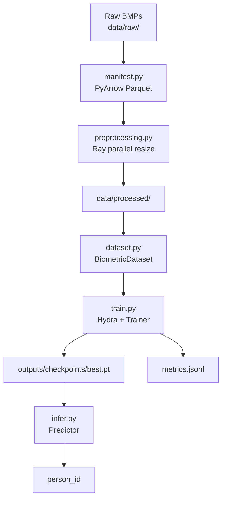

# Multimodal Biometric MLOps Pipeline

End-to-end MLOps pipeline for 45-class person identification from
**iris + fingerprint** images. The goal is production-quality
infrastructure—config-driven training, parallel preprocessing, reproducible
runs, CI/CD.

---

## Architecture



**Model** (PyTorch port of [Kaggle reference](https://www.kaggle.com/code/omidsakaki1370/multimodal-biometric-recognition-system)):

```
FingerprintBranch  →  MobileNetV2 (pretrained, frozen)  →  (B, 1280)
IrisBranch (×2)    →  2× Conv → MaxPool → AvgPool       →  (B, 32) each
                                        ↓
                         concat  →  (B, 1344)
                         Linear(1344→128) → ReLU → Dropout(0.5)
                         Linear(128→45)  →  logits
```

The **same** `IrisBranch` instance processes both left and right iris
(weight sharing, matching the reference).

---

## Quickstart

### 1. Install dependencies

```bash
pip install -r requirements.txt
```

### 2. Dataset

Data is already present at `data/raw/IRIS and FINGERPRINT DATASET/`.

If you need to re-download it:
1. Go to <https://www.kaggle.com/settings/account> → API → *Create New Token*
2. Place the downloaded `kaggle.json` at `~/.kaggle/kaggle.json`
3. Run:

```bash
python -m src.data.downloader
```

### 3. Build the manifest

Scans raw data, picks one file per modality per person, assigns
train/val split, writes `data/manifest.parquet`:

```bash
python -m src.data.manifest
# Force rebuild:
python -m src.data.manifest --rebuild
```

### 4. Parallel preprocessing (Ray)

Resizes all images and saves to `data/processed/`:

```bash
python -m src.data.preprocessing
```

### 5. Train

```bash
python train.py
```

Hydra override examples:

```bash
python train.py training.lr=0.001 training.epochs=30
python train.py model.freeze_backbone=false training.batch_size=4
```

Hydra auto-creates `outputs/<date>/<time>/` with `.hydra/config.yaml`
capturing the full config for every run.

### 6. Infer

```bash
python infer.py \
  +fp=data/processed/fingerprints/1.bmp \
  +left=data/processed/left/1.bmp \
  +right=data/processed/right/1.bmp \
  +ckpt=outputs/checkpoints/best.pt
```

---

## Run tests

```bash
pytest tests/ -v --cov=src --cov-report=term-missing
```

No real dataset required — all tests use synthetic BMP images.

---

## Project structure

```
single_ml_flow/
├── .github/workflows/ci.yml       # GitHub Actions: lint + pytest
├── configs/
│   ├── config.yaml                # root Hydra config
│   ├── data/default.yaml
│   ├── model/default.yaml
│   └── training/default.yaml
├── data/
│   ├── raw/                       # original BMP dataset
│   ├── processed/                 # resized images (Ray output)
│   └── manifest.parquet           # PyArrow table (45 rows)
├── src/
│   ├── data/
│   │   ├── manifest.py            # manifest builder
│   │   ├── preprocessing.py       # Ray parallel resize
│   │   └── dataset.py             # PyTorch Dataset + DataLoaders
│   ├── models/
│   │   └── multimodal_net.py      # IrisBranch + FingerprintBranch
│   ├── training/
│   │   ├── trainer.py             # Trainer class
│   │   └── metrics.py             # MetricsTracker → metrics.jsonl
│   ├── inference/
│   │   └── predictor.py           # Predictor class
│   └── utils/
│       ├── logging_utils.py       # structured logging
│       └── seed.py                # torch/numpy/random seeds
├── tests/                         # pytest suite (synthetic data)
├── train.py                       # Hydra entry point
├── infer.py                       # inference CLI
└── requirements.txt
```

---

## Technology decisions & trade-offs

| Choice | Rationale | Trade-off |
|---|---|---|
| **PyTorch** | Mandatory; explicit control over forward pass | More verbose than Keras |
| **Hydra** | Every run is fully reproducible via auto-saved config | Slight learning curve; outputs/ dir overhead |
| **Ray** | Scalable parallel preprocessing; demonstrates distributed-aware design | ~1–2 s init overhead on 45 images — negligible for larger datasets |
| **PyArrow Parquet** | Fast manifest reload; reproducible split baked in; column-typed | Overengineered for 45 rows; pays off at scale |
| **MobileNetV2 frozen** | Matches reference notebook; avoids overfitting on 45 samples | Fine-tuning (`freeze_backbone=false`) improves accuracy at cost of training time |
| **Shared IrisBranch** | Matches reference; fewer parameters; enforces modality symmetry | Both sides may benefit from separate weights with more data |
| **metrics.jsonl** | Zero dependency; trivially parseable with `jq` or pandas | No built-in dashboard; extend to MLflow/W&B for richer tracking |

---

## Bottleneck analysis

| Bottleneck | Observation | Mitigation |
|---|---|---|
| Ray init on 45 items | `ray.init()` adds ~1–2 s overhead for 135 images | Negligible vs. actual training; use `multiprocessing` for <50 items if speed is critical |
| DataLoader `num_workers=4` | BMP I/O is fast; extra workers add fork overhead on small batches | Set `num_workers=0` for datasets <200 items on single machine |
| MobileNetV2 pretrained download | ~14 MB download on first run | Cache with `TORCH_HOME`; include in Docker image for air-gapped environments |
| Manifest rebuild | `os.walk` on network storage is slow at scale | PyArrow manifest eliminates re-scan; use `--rebuild` only when raw data changes |
